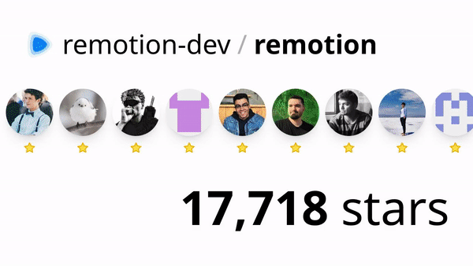

# 🎞️ NPM Downloads Video 📈

Generate beautiful animated videos that highlight your npm package download trends.

## Example output

## TODO

- [ ] Share on X/Twitter button
- [ ] Posthog analytics

## Stack

- [Remotion](https://www.remotion.dev/) to create the video (and [Remotion Lambda](https://www.remotion.dev/docs/lambda/api) to generate it in AWS)
- [Next.js](https://nextjs.org/) for the web application
- [TailwindCSS](https://tailwindcss.com/) for the styling
- [HeroUI](https://heroui.com/) for the UI components
- [npm Downloads API](https://api.npmjs.org) for usage metrics

## Contribute

If you want to suggest a feature or report a problem, feel free to open an issue or even a pull request 😉.

## License

MIT, see [LICENSE](./LICENSE).
